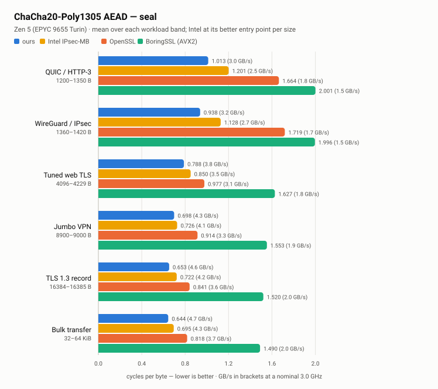
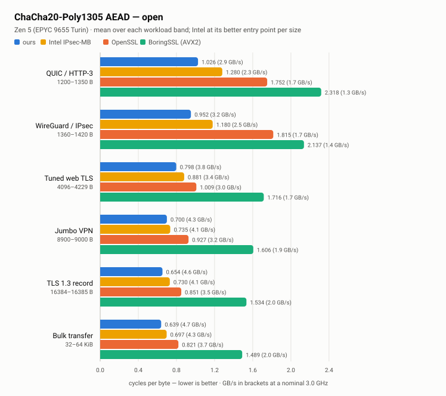
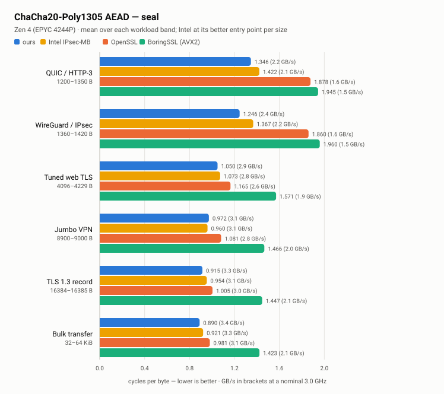
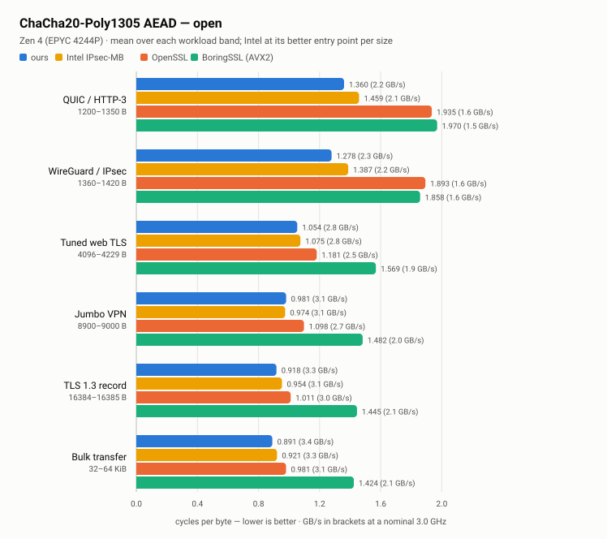
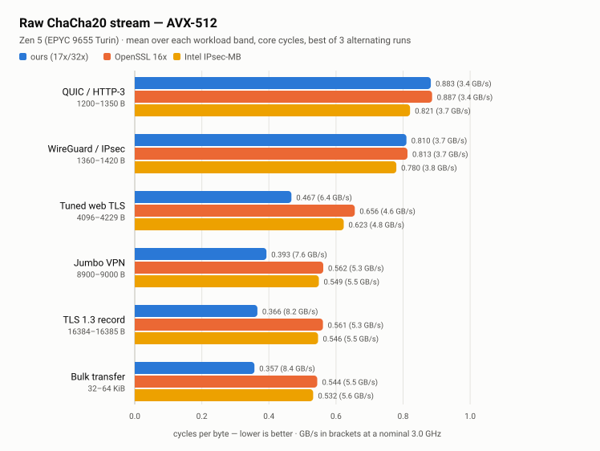
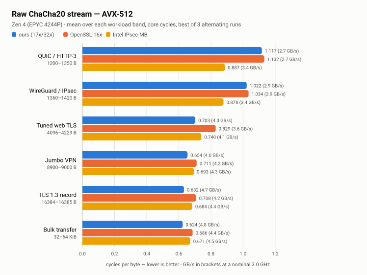
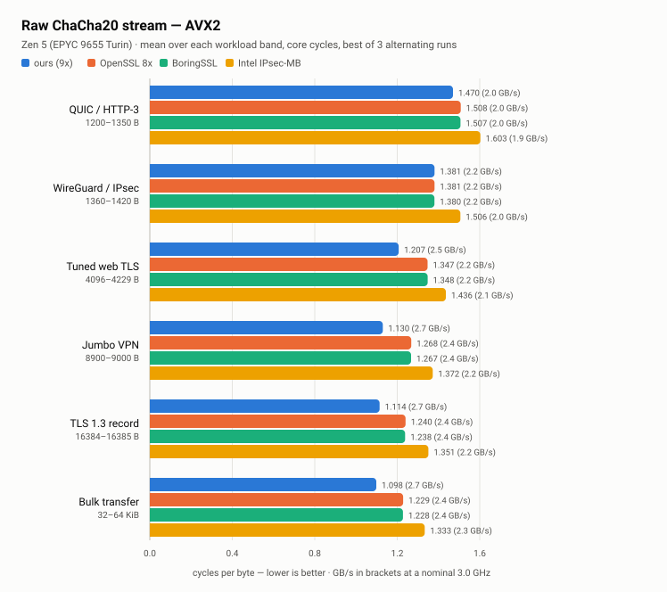
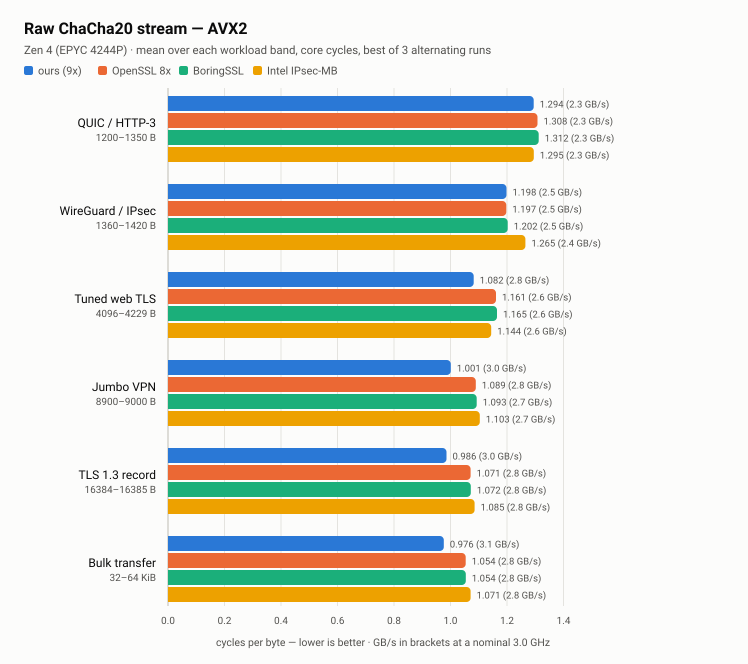

# ChaChaCha

When cryptographic algorithms run vectorized SIMD code, their scalar ALUs often sit idle. I wondered if I could extract extra throughput by putting those idle units to work—first by "self-stitching" extra scalar blocks alongside SIMD (9x AVX2 / 17x AVX-512 based on OpenSSL), and then by building an AVX-512 fused AEAD (ChaCha20 + Poly1305 MAC) inspired by BoringSSL's AVX2 cross-stitching.

ChaCha20 is an ideal testbed: a simple, software-friendly ARX (Add-Rotate-XOR) cipher widely deployed across WireGuard VPN, TLS 1.3, and QUIC.

This repository implements optimized x86-64 AVX2 and AVX-512 kernels for ChaCha20 and ChaCha20-Poly1305, featuring wider raw schedules (up to 32x ILP-8), a fused AEAD pipeline, and single-dispatch key-mode kernels that eliminate startup latency on small network packets.

---

## Performance & Benchmarks

All charts below are **core cycles per byte, lower is better**.

Full tables — all four implementations, every length, both machines — are in **[result.md](result.md)**; raw CSVs are in [results/raw](results/raw).

Measured as core cycles from `perf_event_open`. Process pinned to one core, implementations alternating order every repetition so run order and thermal drift result less, best of 7 internal repetitions and 3 whole runs (for final results I ran it many times). Every implementation is checked for identical output at every length.

### Complete AEAD (ChaCha20-Poly1305)

Complete ChaCha20-Poly1305, against Intel IPsec-MB and BoringSSL's stitched AVX2 implementation. Intel is shown at **its better of two entry points per size** — the job API and the documented single-buffer API each win at different lengths, taking the minimum for a fair comparison.

| Machine | seal | open |
|:---:|:---:|:---:|
| **Zen 5** | [](results/figures/aead_seal_zen5.svg) | [](results/figures/aead_open_zen5.svg) |
| **Zen 4** | [](results/figures/aead_seal_zen4.svg) | [](results/figures/aead_open_zen4.svg) |

#### Speedup vs Intel IPsec-MB at Canonical Protocol Sizes:

| Size (B) | Protocol Target | Zen 5 (Seal / Open) | Zen 4 (Seal / Open) |
|---:|---|:---:|:---:|
| **1280** | QUIC / IPv6 Min MTU | **+18.5% / +23.0%** | **+9.5% / +10.3%** |
| **1420** | WireGuard IPv4 | **+17.5% / +19.6%** | **+10.6% / +8.1%** |
| **1500** | Standard Ethernet MTU | **+14.9% / +19.3%** | **+12.3% / +13.3%** |
| **2048** | 2 KB TLS Record | **+34.8% / +38.0%** | **+12.3% / +15.0%** |
| **4096** | 4 KB Page / TLS Record | **+12.5% / +15.3%** | **+2.8% / +5.1%** |
| **9000** | Jumbo Ethernet Frame | **+3.8% / +4.8%** | **−1.8%** / +0.5% |
| **16384**| Max TLS 1.3 Record | **+9.9% / +10.7%** | **+3.2% / +4.7%** |
| **65536**| Bulk Transfer | **+7.5% / +8.5%** | **+4.3% / +3.8%** |

**Summary:**
* **Small Packets ($\le 2\,\text{KB}$):** Strongest gains appear at canonical network sizes (WireGuard 1420 B, Ethernet 1500 B, 2 KB TLS)—delivering **+15% to +38% on Zen 5** and **+8% to +15% on Zen 4** over Intel IPsec-MB.
* **Bulk Streams ($>4\,\text{KB}$):** Sustained **7–15% lead on Zen 5** and **3–5% on Zen 4** across large record sizes.

---

### AVX-512 Raw ChaCha20

My dispatcher — 17x below 2240 bytes, 32x above — against OpenSSL's 16x and Intel IPsec-MB. **BoringSSL is absent because it has no AVX-512 ChaCha20**; its comparison appears only in the AEAD benchmarks, where it ships an AVX2 stitched implementation.

| Zen 5 | Zen 4 |
|:---:|:---:|
| [](results/figures/raw_avx512_zen5.svg) | [](results/figures/raw_avx512_zen4.svg) |

**Summary:**
* **Zen 5:** Produces a **25–33% throughput lead** over OpenSSL and Intel IPsec-MB for data streams 4 KB and larger.
* **Zen 4:** Yields a **5–8% lead** over OpenSSL on bulk data.

---

### AVX2 Raw ChaCha20

My 9x schedule against OpenSSL, BoringSSL, and Intel IPsec-MB. All four produce identical keystreams, checked at every length before timing.

| Zen 5 | Zen 4 |
|:---:|:---:|
| [](results/figures/raw_avx2_zen5.svg) | [](results/figures/raw_avx2_zen4.svg) |

**Summary:**
* Delivers a sustained **10% speedup on Zen 5** and **7–8% on Zen 4** over OpenSSL and BoringSSL for messages above a few kilobytes.

---

## How It Works: The Story Behind Each Kernel

This section walks through the hardware and cryptographic bottlenecks faced, why each assembly kernel was built, and how they operate together.

```
       RAW CIPHER                      FUSED STEADY-STATE                    PACKET OPTIMIZATION
+-----------------------+          +------------------------+          +-----------------------------+
| ChaCha20_9x / 17x     |          | ChaCha20_16x_mac*      |          | ChaCha20_33x_key / 25x_key  |
| Self-stitching scalar |  ----->  | Fused cipher + MAC     |  ----->  | Single-pass key derivation  |
| and vector blocks     |          | 2-chain range split    |          | Wiping out launch latency   |
+-----------------------+          +------------------------+          +-----------------------------+
            |                                  |                                       |
            v                                  v                                       v
+-----------------------+          +------------------------+          +-----------------------------+
| ChaCha20_32x (ILP 8)  |          | Staggered Scheduling   |          | Residue & Bridge Finalizers |
| Dual 16-block states  |          | Staggered issue orders |          | poly1305_ifma.asm (suffix)  |
| Register rematerialize|          | Feeds out-of-order ALU |          | poly1305_pow.S (A*r^m + B)  |
+-----------------------+          +------------------------+          +-----------------------------+
```

---

### 1. Reclaiming Idle Core Capacity: `ChaCha20_9x` & `ChaCha20_17x`

#### How ChaCha20 Works:
ChaCha20 is a stream cipher designed by Daniel J. Bernstein. It maintains a state matrix of sixteen 32-bit words (64 bytes total):

```text
+-------------------+-------------------+-------------------+-------------------+
|    "expa" (c0)    |    "nd 3" (c1)    |    "2-by" (c2)    |    "te k" (c3)    |  <- Constants
+-------------------+-------------------+-------------------+-------------------+
|    Key 0  (k0)    |    Key 1  (k1)    |    Key 2  (k2)    |    Key 3  (k3)    |  <- 256-bit Key
+-------------------+-------------------+-------------------+-------------------+
|    Key 4  (k4)    |    Key 5  (k5)    |    Key 6  (k6)    |    Key 7  (k7)    |
+-------------------+-------------------+-------------------+-------------------+
|   Counter (ctr)   |   Nonce 0 (n0)    |   Nonce 1 (n1)    |   Nonce 2 (n2)    |  <- Counter & Nonce
+-------------------+-------------------+-------------------+-------------------+
```

The cipher runs 20 rounds of Quarter Rounds (Add-Rotate-XOR / ARX operations) alternating between 4 matrix columns and 4 diagonals:

```c
/* Each Quarter Round (a, b, c, d) */
a += b;  d ^= a;  d <<<= 16;
c += d;  b ^= c;  b <<<= 12;
a += b;  d ^= a;  d <<<= 8;
c += d;  b ^= c;  b <<<= 7;
```

At the end of the 20 rounds, the original initial state matrix is added back to the mixed state, producing a 64-byte keystream block that is XORed with plaintext:
```text
Output Keystream = Initial_State + Mixed_State
```

Because different 64-byte blocks only differ by their block counter (`ctr`), **different blocks are mathematically independent**. This makes vectorization straightforward: AVX2 computes 8 blocks simultaneously in 256-bit YMM registers ($512\,\text{B}$ per pass), while AVX-512 computes 16 blocks simultaneously in 512-bit ZMM registers ($1024\,\text{B}$ per pass).

#### The Problem:
When you vectorize ChaCha20 with 8 or 16 parallel vector blocks, the CPU's SIMD vector execution ports are fully loaded. However, modern x86 cores also have 4 to 6 general-purpose integer ALU ports that sit completely idle during this time. 

#### The Solution:
We can "self-stitch" the algorithm by computing one extra ChaCha block purely in general-purpose integer registers (GPRs) in parallel with the vector blocks:
* **`ChaCha20_9x` (AVX2):** Computes 8 blocks in vector registers ($512\,\text{B}$) plus 1 block in scalar registers ($64\,\text{B}$) = **$576\,\text{bytes}$ per pass**.
* **`ChaCha20_17x` (AVX-512):** Computes 16 blocks in vector registers ($1024\,\text{B}$) plus 1 block in scalar registers ($64\,\text{B}$) = **$1088\,\text{bytes}$ per pass**.

The scalar quarter-round instructions (adds, XORs, and rotates) are interleaved directly between vector instructions. Because they execute on separate physical execution ports, the CPU issues them during vector pipeline stalls at virtually zero added cycle cost. This gives theoretical throughput boosts of $+12.5\%$ ($9/8$) for AVX2 and $+6.25\%$ ($17/16$) for AVX-512.

#### Why Not 10x or 18x?
A scalar ChaCha state takes 16 32-bit words. Packed into 64-bit registers, it needs 10–12 registers for state and scratch arithmetic. Adding a second scalar block would require ~28 GPRs, but x86-64 only has 16 (and only ~14 usable after ABI overhead). Spilling to stack memory destroys performance, making 9x and 17x the hard physical limit for register-resident scalar stitching.

#### Avoiding Slow Scalar Tails:
A 9x iteration produces 576 bytes, while a standard 8x iteration produces 512 bytes. 
* If a message is 550 bytes, running 9x handles it in **one pass** (576 B capacity), whereas 8x would need a full pass (512 B) *plus* a second tail pass for the leftover 38 bytes. Here, 9x is a clear win.
* But if a message is 600 bytes, running 9x processes 576 bytes and leaves a 24-byte residue. Meanwhile, sticking to the standard 8x path processes 512 bytes, leaving 88 bytes that can cleanly step through the fast vector tail ladder ($4\text{x} \to 2\text{x} \to 1\text{x}$ vector blocks). The hybrid path leaves an awkward residue that forces the engine onto slow scalar tail cleanup instead of fast vector tails.

To prevent this, the dispatcher checks whether the scalar block actually saves a full pass before taking the hybrid path:
```text
# Evaluated in ~1 cycle via bit shifts: ((len - 1) >> 6) divides by the 64-byte block size
hybrid_loses = len >= (BATCH_SIZE * ((len - 1) >> 6)) + 65   # BATCH = 512 (AVX2) or 1024 (AVX-512)
```
If the hybrid doesn't save a complete pass, it bypasses `9x`/`17x` entirely and routes directly to the standard vector tail ladder ($16\text{x} \to 8\text{x} \to 4\text{x} \to 2\text{x} \to 1\text{x}$).

---

### 2. Breaking the CPU Dependency Limit: `ChaCha20_32x`

#### The Bottleneck:
ChaCha's internal math consists of 4 quarter rounds operating on matrix columns and diagonals. This means there are only 4 independent dependency chains that can execute in parallel—an Instruction-Level Parallelism (ILP) of 4. On wide execution cores like AMD Zen 5 (which can decode and dispatch up to 8 instructions per cycle), ILP 4 is not enough work to keep all vector pipelines fed. The core frequently stalls waiting for quarter-round results.

#### The Interleaved Dual State:
`ChaCha20_32x` runs **two independent 16-block vector states** (`State A` and `State B`, totaling 32 blocks = **$2048\,\text{bytes}$ per pass**) interleaved in the exact same loop. 

Because State A and State B are mathematically independent, their quarter-round instructions have no dependencies between each other. This doubles the ILP from 4 to 8, fully saturating Zen 5's execution pipes and producing a massive **25–33% speedup** on bulk data.

#### Saving Registers with Re-materialization:
Running 32 parallel vector blocks requires all 32 AVX-512 registers (`zmm0` through `zmm31`) just to hold the active states during the quarter rounds. 

However, at the end of the 20 rounds, ChaCha requires you to add the original initial matrix state back to the mixed state:
```text
Output = Initial_State + Mixed_State
```

Normally, you would keep the initial state in 16 registers so you can add it at the end. But all 32 registers are already in use! To solve this without spilling to the stack, `ChaCha20_32x` uses **register re-materialization**: it broadcasts the initial constants directly from read-only memory operands on the fly during the final vector addition (`vpaddd zmm, zmm, [mem]{1to16}`). This leaves all 32 registers completely free for computation throughout the entire loop.

---

### 3. Fusing Encryption with Authentication: `ChaCha20_16x_mac*`

#### How Poly1305 Works & Why It Is Independent of ChaCha:
Poly1305 is a high-speed Message Authentication Code (MAC), **also designed by Daniel J. Bernstein**. In modern cryptographic protocols (like RFC 8439, TLS 1.3, and WireGuard), ChaCha20 and Poly1305 are almost always paired together as **ChaCha20-Poly1305 Authenticated Encryption with Associated Data (AEAD)**—ChaCha provides confidentiality (encryption) while Poly1305 provides integrity and authenticity (tag generation).

Poly1305 takes a 32-byte one-time key split into two 16-byte halves $(r, s)$, chops the message into 16-byte chunks $c_1, c_2, \dots, c_m$, and evaluates a polynomial in the Galois field modulo $2^{130}-5$:

```text
Tag = ( (c1 * r^m) + (c2 * r^(m-1)) + ... + (cm * r) + s ) mod (2^130 - 5)
```

Using Horner's rule, this is processed iteratively per 16-byte block:
```c
accumulator = ((accumulator + block_i) * r) % (2^130 - 5);
```

**Why ChaCha and Poly1305 are fundamentally independent:**
* **ChaCha20** is a symmetric stream cipher performing 32-bit bitwise ARX operations (Add-Rotate-XOR) on SIMD vector registers to turn plaintext into ciphertext.
* **Poly1305** is an authentication hash performing 130-bit multi-precision integer arithmetic ($64\times 64 \to 128$-bit `mulx` multiplications and additions) on scalar integer registers to authenticate that ciphertext.

Because they operate on completely different data structures and use completely separate CPU hardware execution units (SIMD vector pipes for ChaCha vs integer ALU ports for Poly1305), they can execute concurrently inside the same CPU core without interfering with each other's dependency chains.

#### Why Fuse Them?
In real-world AEAD, ChaCha20 and Poly1305 almost always run together. BoringSSL cross-stitched them in AVX2, but avoided AVX-512 due to CPU frequency scaling concerns (see [Cloudflare's writeup](https://blog.cloudflare.com/on-the-dangers-of-intels-frequency-scaling/)). I ported this fused model to AVX-512, expecting my faster vector cipher to speed up the loop—but benchmarks showed **zero speedup**.

#### The Poly1305 Bottleneck:
When I measured each standalone component per 1024 bytes on Zen 5, the reason became clear:
* Standalone Scalar Poly1305 MAC: **530 cycles**
* Standalone AVX-512 ChaCha20 Cipher: **324 cycles**
* Fused Together: **532 cycles**

With AVX-512 vector width, ChaCha is so fast that it finishes in 324 cycles and hides completely inside the 530-cycle shadow of the scalar Poly1305 MAC. The MAC is the real bottleneck. This is why doubling raw cipher ILP was worth +34% in isolation, but gained 0% in the fused loop—the loop is entirely bounded by scalar Poly1305 execution time.

*Why not just vectorize Poly1305 (e.g. using AVX-512 IFMA)?* Because vector Poly1305 and vector ChaCha would compete for the exact same SIMD vector execution ports, creating port contention. I measured that running IFMA's vector operations on top of the cipher's vector operations took 663 cycles at the vector-op ceiling—which was actually slower than the scalar path. The way we can achieve concurrency here is keeping ChaCha on vector ports and Poly1305 on scalar integer ports.

#### The Fused Loop (`ChaCha20_16x_mac*`):
The steady-state loop processes 1024 bytes per iteration: 16 ZMM registers encrypt 1024 bytes of keystream while scalar integer ALUs authenticate the *previous* 1024 bytes of ciphertext.

Because this loop was built from BoringSSL's AEAD scaffold, it originally inherited BoringSSL's AVX2 3-instruction sequence (`vpsrld`, `vpslld`, `vpor`) for rotates. Moving to AVX-512 allowed using OpenSSL's native single-instruction `vprold`, cutting rotate instructions by $3\times$ and immediately relieving vector-port pressure on the critical dependency chain.

#### Why Range Splitting Instead of Alternating Blocks?
One scalar Poly1305 chain cannot keep up with 1024 bytes of keystream, so the design uses two parallel Poly1305 chains.
* *Why not alternate blocks (even blocks in Chain 1, odd blocks in Chain 2)?* In Poly1305, each step multiplies by $r$. If you alternate blocks, each chain must multiply by $r^2$. But $r$ is specially clamped with clear bits ($r \land \text{0x0ffffffc0ffffffc...}$) to allow fast modular reduction without carry propagation. $r^2$ is not clamped, making every single modular multiply much slower and destroying any benefit.
* *The Contiguous Range Split:* Instead, the kernel splits each 1024-byte chunk into **two contiguous 512-byte halves**. Both chains multiply by the cheap, clamped $r$. At the end of the pass, they are combined only once using:
```text
H = (A * r^32 + B) mod (2^130 - 5)
```

#### Staggering Instructions to Fill ALU Gaps:
Each ChaCha quarter-round executes a sequence of 4 dependent steps ($a += b$, $d \oplus= a$, $d \lll= 16$, etc.) where each instruction must wait for the previous result.

If all 4 parallel quarter-round chains are executed in lockstep (all 4 chains computing Step 1 simultaneously, then Step 2, etc.), they all hit the exact same dependency stall at the same time. The CPU's out-of-order execution window gets flooded with instructions that are all blocked waiting on the same latency stage.

Intel's IPsec Multi-Buffer library (`intel-ipsec-mb`) solves this by **staggering the issue phases**: Chain 0 starts at Step 1, Chain 1 at Step 2, Chain 2 at Step 3, and Chain 3 at Step 4. When one chain is stalled waiting on an arithmetic latency cycle, another chain's rotate or XOR is already ready to execute. We adapted this staggered order directly into the fused schedule, interleaving scalar Poly1305 instructions into the vector dependency gaps so the CPU's execution units are continuously supplied with ready operations.

---

### 4. Small Packets: Single-Dispatch Key Mode (`33x_key` & `25x_key`)

#### The Problem:
In real-world networks (WireGuard VPN, QUIC, TLS 1.3), most packets are $\le 2048\,\text{bytes}$ (e.g. 1280 B IPv6 MTU, 1420 B WireGuard, 1500 B Ethernet). 

In RFC 8439:
* **Block 0 (Counter 0):** Generates the 32-byte one-time Poly1305 key ($r, s$).
* **Blocks 1..N (Counter $\ge 1$):** Encrypts the payload.

Standard crypto libraries launch **two separate assembly dispatches**:
1. Run ChaCha on counter 0 $\rightarrow$ extract Poly1305 key.
2. Run ChaCha on counters 1..N $\rightarrow$ encrypt payload.

Every kernel dispatch pays roughly **~400 cycles of startup latency** (stack frame setup, register saving, and initial round dependency pipeline fill). On a 1280-byte packet, that extra launch wastes up to 30–40% of the entire execution time.

#### The Single-Dispatch Solution:
The key-mode kernels evaluate counter 0 and counters 1..N in a **single function launch**:
* **Scalar GPRs:** Compute Block 0 (counter 0) to extract the Poly1305 key.
* **AVX-512 ZMMs:** Simultaneously compute payload blocks (counters 1..N).

When the kernel returns, the ciphertext is encrypted and the Poly1305 key is already unpacked and clamped in registers, ready to authenticate immediately with zero dispatch penalty.

#### Why Two Sizes (`33x_key` vs `25x_key`)?
* **`ChaCha20_33x_key` ($1537\text{--}2048\,\text{bytes}$):** Runs 32 vector blocks ($2048\,\text{B}$ payload) $+$ 1 scalar block (Poly1305 key).
* **`ChaCha20_25x_key` ($1025\text{--}1536\,\text{bytes}$):** Runs 24 vector blocks ($1536\,\text{B}$ payload) $+$ 1 scalar block (Poly1305 key), using a $16 + 8$ lane configuration.
* *Why not always use 33x?* On CPUs like Zen 4 that double-pump 512-bit vector units (executing 512-bit ops across two 256-bit pipes), unused vector lanes still consume execution cycles. `25x_key` provides an exact fit for 1500 B Ethernet and 1420 B WireGuard packets so Zen 4 doesn't waste energy calculating unused keystream blocks.

---

### 5. Tail Residues & Bridges: `poly1305_ifma.asm` & `poly1305_pow.S`

#### Seal vs. Open Pipelines:
* **Open (Decryption + Auth):** The ciphertext already exists in memory from the start. Poly1305 can immediately start authenticating the data while ChaCha decrypts it.
* **Seal (Encryption + Auth):** Poly1305 cannot authenticate a block until ChaCha finishes encrypting it into ciphertext. This requires an initial "fill" phase (encrypt block 1 before auth starts) and a "drain" phase at the end.

#### Handling Leftover Residues:
When a message doesn't divide evenly into 1024-byte steady-state chunks, how does the pipeline finish the leftover bytes (the residue)?
* **Small Residues ($\le 768\,\text{bytes}$):** Setting up vector IFMA constants takes more time than it saves. Small leftovers are finished using the fast scalar Poly1305 path.
* **Large Residues ($> 768\,\text{bytes}$):** `poly1305_ifma.asm` kicks in, using AVX-512 IFMA52 ($52\times 52 \to 104$-bit integer multiply-accumulate) to process the large tail at maximum vector speed.

#### Joining Split Accumulators (`poly1305_pow.S`):
When a suffix is authenticated independently with IFMA, its result cannot simply be added to the running scalar accumulator. For an $m$-block suffix, the math requires an accumulator bridge:
```text
H_total = (A * r^m + B) mod (2^130 - 5)
```
`poly1305_pow.S` calculates the modular exponentiation $r^m \pmod{2^{130}-5}$, folds bit 130 back into the field using the identity $2^{130} \equiv 5 \pmod{2^{130}-5}$, and multiplies the accumulators together to finalize the tag.

---

## Final Thoughts

At the end of the day, this whole project was just a fun experiment to see how far execution resources could be pushed. There's always a chance I made some mistakes along the way, but exploring the assembly schedules and microarchitecture quirks was a lot of fun.

A few takeaways from building and measuring this:
1. **Simpler algorithms are often better in practice:** OpenSSL and Intel IPsec-MB. Just call them sequentially, and I think they are fast enough. The fused kernel can hide latency easily on its ideal block size, but the hard part, and what I feel is messy, is the tail handling: how to process work that isn't handled by the fused kernel at its comfortable size. Since the authentication work is effectively N-1, it needs special start and end handling. I couldn't just give up after writing some part that is faster on steady state but then gets slowed down by the other stuff. Also, before this, I didn't know most ChaCha usage happened on such small buffer sizes.
2. **Frequency scaling & SMT:** BoringSSL uses AVX2 on purpose, since AVX-512 can throttle frequency on the whole core (as detailed in [Cloudflare's writeup](https://blog.cloudflare.com/on-the-dangers-of-intels-frequency-scaling/)). I'm not sure nowadays if it's still a concern, but it can happen, and also SMT exists for this reason. I think SMT can also exploit those unused resources, just on neighbours. So I am mainly trying to test single-core performance, not how it behaves with a neighbour.

From what I measured, there are still physical execution resources left on the table. In the fused loop, the AVX-512 cipher finishes in 324 cycles while scalar Poly1305 takes 530 cycles, leaving the vector units sitting idle for ~200 cycles waiting for the MAC. At the same time, cores like Zen 5 have 6 integer ALU ports, but the 2 scalar Poly1305 chains only keep 2 to 3 ports busy at a time. I tried several ideas to capture those remaining resources, but hit practical limits. The CPU runs out of usable registers (~14 GPR limit) for extra scalar chains, and vectorizing Poly1305 with IFMA creates SIMD port contention with ChaCha. Adding more polynomial splits introduces combining power ladders ($A \cdot r^k + B$) that cost more instructions than they save. I also tried Karatsuba multiplication (`poly1305_pow_karatsuba.S`), but the limb-unpacking, middle-term adds, and carry reduction overhead wiped out the multiply savings. Even ADX (`adcx`/`adox`) parallel carry chains turned out to be architecture-dependent—it helped on Zen 4, but regressed on Zen 5 because Zen 5's integer ALUs handle standard addition flags faster.

This whole work would probably also be interesting on architectures with more registers, like ARM. But I haven't looked into how they implement ChaCha/Poly1305 and I don't have an ARM machine to test on.

---

## Quick Start & C API Usage

If you test or benchmark this library, it would be really interesting to see how these kernels perform across other x86-64 microarchitectures (e.g. Intel Ice Lake, Sapphire Rapids, Alder Lake / Raptor Lake, or older Zen) and especially how they behave with SMT hyperthread neighbours sharing core resources!

### 1. Build and Test
Requirements: Linux x86-64 with `gcc` and `make`.

```bash
# Build and run all verification tests
make -j"$(nproc)" test
```

### 2. C API Example (`example.c`)

```c
#include <stdio.h>
#include <string.h>
#include "chacha20poly1305.h"

int main(void) {
    uint8_t key[32] = "01234567890123456789012345678901";
    uint8_t nonce[12] = "uniquepacket";
    const char *ad = "header_data";
    const char *plaintext = "WireGuard / QUIC fast-path payload!";
    size_t in_len = strlen(plaintext);

    uint8_t ciphertext[128];
    size_t ct_len = 0;
    
    uint8_t decrypted[128];
    size_t dt_len = 0;

    printf("AVX-512 Active: %s\n", chacha20_poly1305_using_avx512() ? "Yes" : "No");

    /* 1. Seal (Encrypt + Authenticate) */
    /* Out buffer must have space for in_len + 16 bytes for the tag */
    if (!chacha20_poly1305_seal(ciphertext, &ct_len, sizeof(ciphertext),
                                (const uint8_t *)plaintext, in_len,
                                (const uint8_t *)ad, strlen(ad),
                                key, nonce)) {
        fprintf(stderr, "Seal failed!\n");
        return 1;
    }
    printf("Encrypted %zu bytes -> %zu bytes (with 16B tag)\n", in_len, ct_len);

    /* 2. Open (Authenticate + Decrypt) */
    if (!chacha20_poly1305_open(decrypted, &dt_len, sizeof(decrypted),
                                ciphertext, ct_len,
                                (const uint8_t *)ad, strlen(ad),
                                key, nonce)) {
        fprintf(stderr, "Authentication failed! Ciphertext or tag corrupted.\n");
        return 1;
    }
    decrypted[dt_len] = '\0';
    printf("Decrypted: \"%s\"\n", decrypted);

    return 0;
}
```

Compile and run:
```bash
gcc -O3 -mavx512f -mavx512vl -mavx512bw -mavx512ifma example.c build/chacha20poly1305.a -o example
./example
```

---

## Prior Art and Source Lineage

Function stitching was introduced in Intel's 2010 work (Gopal, Feghali, et al.), interleaving independent vector and scalar operations across execution ports.

| Upstream Project | Lineage & Components Used |
|---|---|
| **OpenSSL / Cryptogams** | Andy Polyakov's raw ChaCha20 assembly: AVX2 8x, AVX-512 16x, smaller tail kernels, Perlasm engine, and x86-64 translator. |
| **BoringSSL / Cloudflare** | Vlad Krasnov's stitched AVX2 AEAD (512-byte YMM batches with scalar Poly1305). Its seal/open state machine formed the original scaffold. |
| **Intel IPsec Multi-Buffer** | AVX-512 IFMA Poly1305 suffix engine and staggered ChaCha instruction ordering. |

Local implementation files:
* [chacha_kernels.pl](chacha_kernels.pl): OpenSSL baseline extended with 9x, 17x, 32x ILP-8, and 25x/33x key-mode schedules.
* [aead512.pl](aead512.pl): 512-bit stitched AEAD pipeline and dispatch orchestration.
* [aead_mac.S](aead_mac.S): Dual-chain scalar Poly1305 fused with AVX-512 ChaCha20.
* [poly1305_ifma.asm](poly1305_ifma.asm): Self-contained IFMA finalizer.
* [poly1305_pow.S](poly1305_pow.S): General modular multiply and power ladder for joining split ranges.

---

## License

Copyright 2026 soda4fries. Licensed under the [Apache License, Version 2.0](LICENSE).

Incorporates code from OpenSSL, BoringSSL, and Intel IPsec-MB. See [NOTICE](NOTICE) and [vendor/README.md](vendor/README.md) for full licensing details.